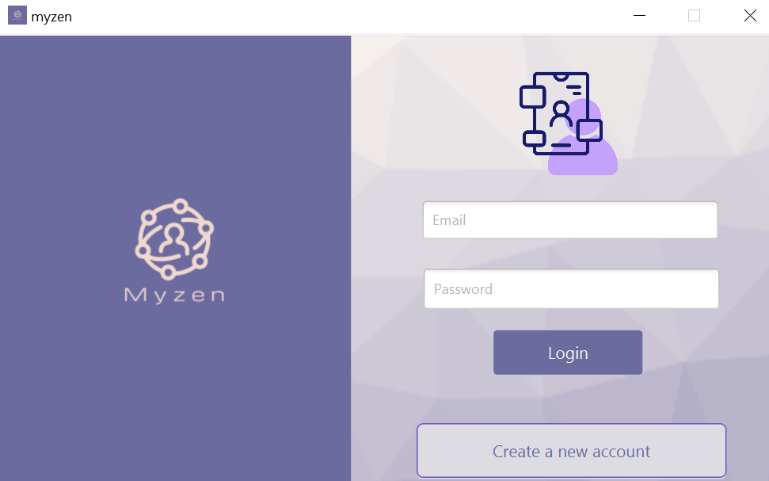
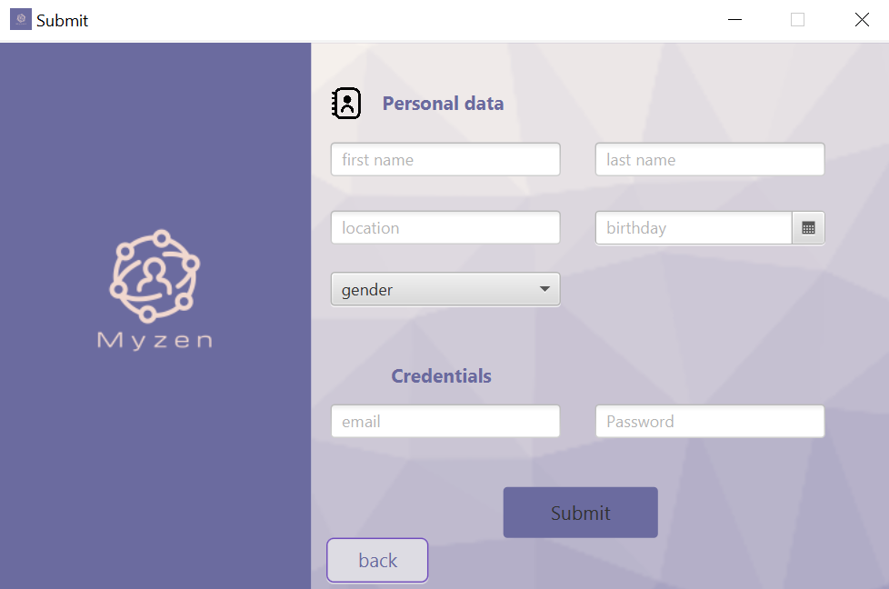
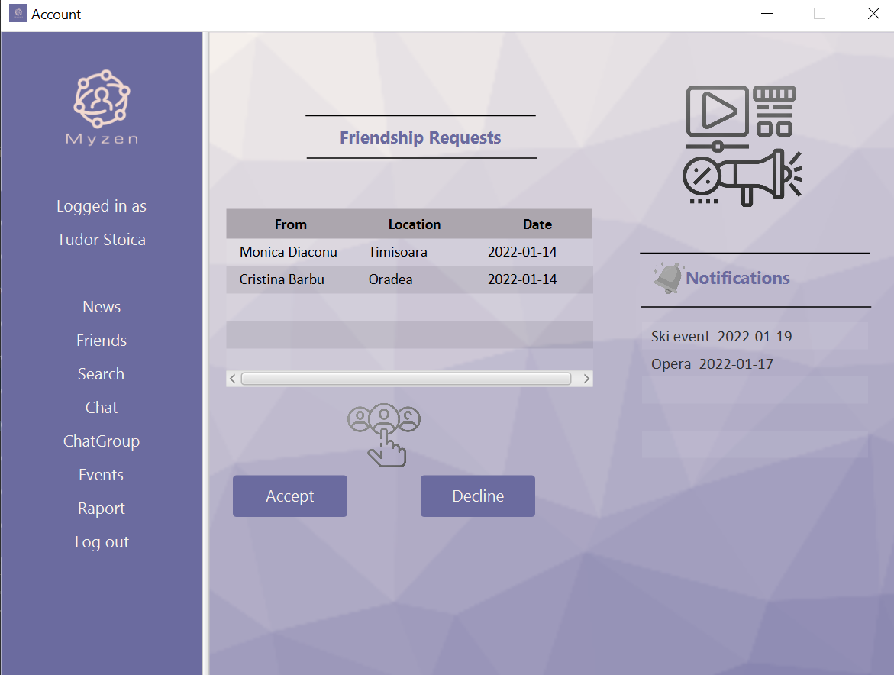
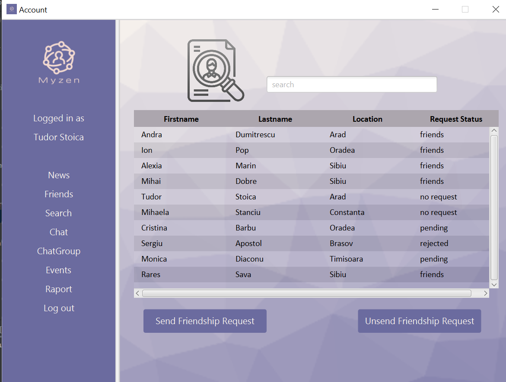
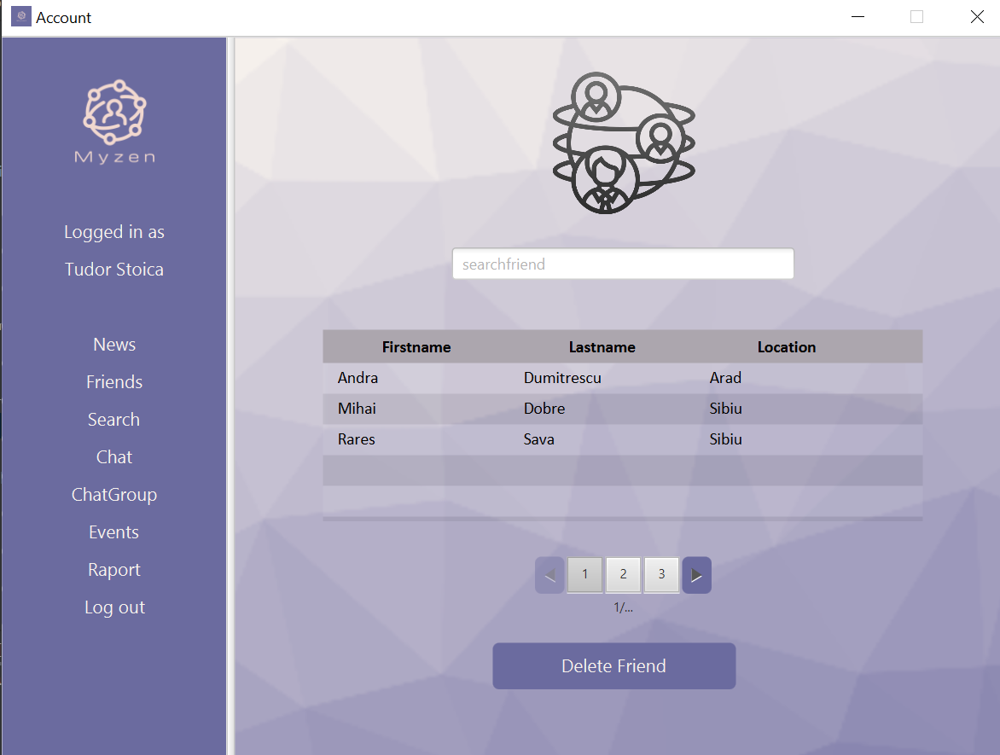
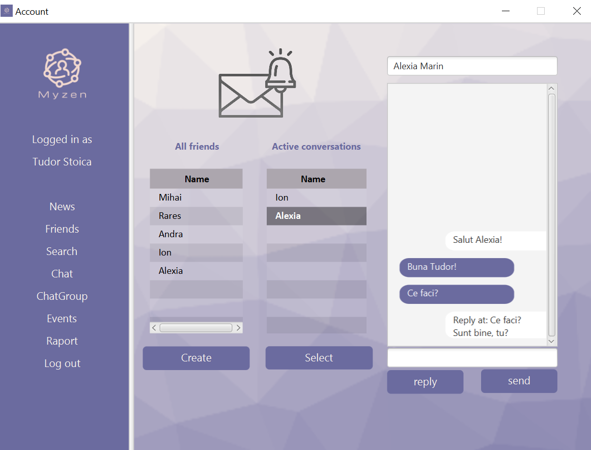
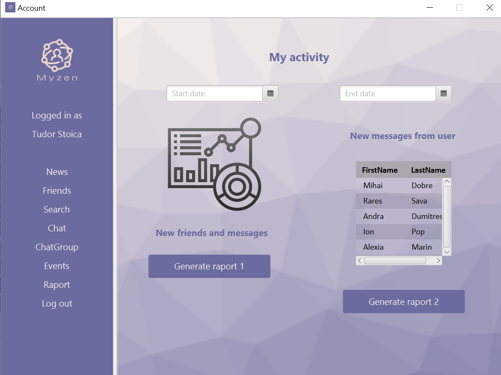
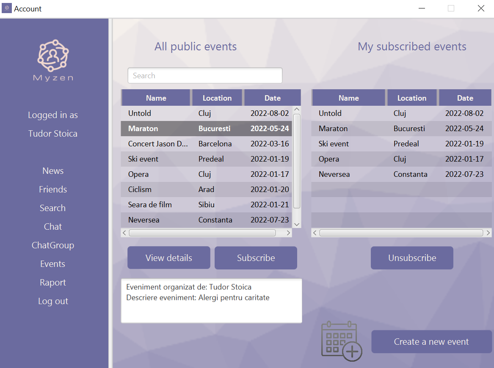

# Myzen – Social Network

A social networking application developed in Java with a graphical user interface in JavaFX, using the Observer pattern. Myzen includes various social networking features like creating a profile, managing friendships, chatting with users, organizing events, and generating user activity reports.

### Screenshots

<table>
  <tr>
    <td></td>
    <td></td>
    <td></td>
    <td></td>
  </tr>
  <tr>
    <td></td>
    <td></td>
    <td></td>
    <td></td>
  </tr>
</table>

## Features

- **Login/Register Panel**: Users can create new accounts or log in using their credentials.  
- **User Profile**: Display user details, manage friend requests, and check notifications.  
- **Friendship Management**: Search for users, send/unsend friendship requests, and accept/decline requests.  
- **Friends List**: View and manage your list of friends.  
- **Private and Group Chats**: Real-time messaging and group chat creation.  
- **Event Management**: Create, join, and get notified about events.  
- **Activity Reports**: View detailed activity history over a chosen period.

## Installation

1. Clone the repository:

   ```bash
    git clone https://github.com/BiancaM30/Advanced-Programming-Methods.git
    cd Advanced-Programming-Methods/Toy Social Network

2. Open the project in your preferred Java IDE (e.g., IntelliJ, Eclipse).

3. Build and run the project to start using the application.

## Usage
  - Login/Register: Start by creating an account or logging in.
  - Manage Friendships: Search for friends, send/accept requests, and manage your friend list.
  - Chat: Create or join a chat and start conversations with your friends.
  - Events: Organize and participate in events, subscribe to notifications, and keep track of public and private events.
  - Reports: Generate custom reports about your interactions and activity over specific periods.

