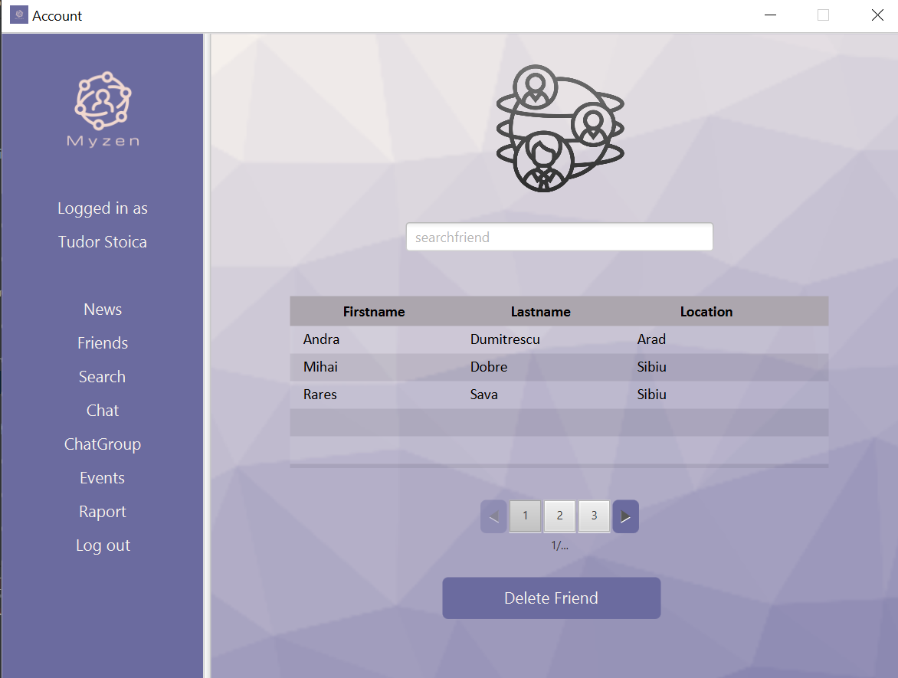

# Advanced-Programming-Methods
# Myzen – Social Network

A social networking application developed in Java with a graphical user interface (GUI) using the Observer pattern. Myzen includes various social networking features like creating a profile, managing friendships, chatting with users, organizing events, and generating user activity reports.

## Features

- **Login/Register Panel**: Users can create new accounts or log in using their credentials.
  
  

  

- **User Profile**: Display user details, manage friend requests, and check notifications.

  

- **Friendship Management**: 
  - Search for users and send/unsend friendship requests.
  - Accept or decline incoming friendship requests.
  
  

- **Friends List**: View and manage your list of friends.

  

- **Private and Group Chats**: 
  - Create and participate in private and group chats.
  - Real-time messaging with other users.
  
  

- **Event Management**: 
  - Create events and invite friends.
  - Subscribe/unsubscribe to notifications for events.
  
  

- **Activity Reports**: 
  - Generate reports that display a user’s activity, including new friends and messages, over a specified period.
  
  

## Installation

1. Clone the repository:

   ```bash
    git clone https://github.com/BiancaM30/Advanced-Programming-Methods.git
    cd Advanced-Programming-Methods/Toy Social Network

2. Open the project in your preferred Java IDE (e.g., IntelliJ, Eclipse).

3. Build and run the project to start using the application.

## Usage
  - Login/Register: Start by creating an account or logging in.
  - Manage Friendships: Search for friends, send/accept requests, and manage your friend list.
  - Chat: Create or join a chat and start conversations with your friends.
  - Events: Organize and participate in events, subscribe to notifications, and keep track of public and private events.
  - Reports: Generate custom reports about your interactions and activity over specific periods.

